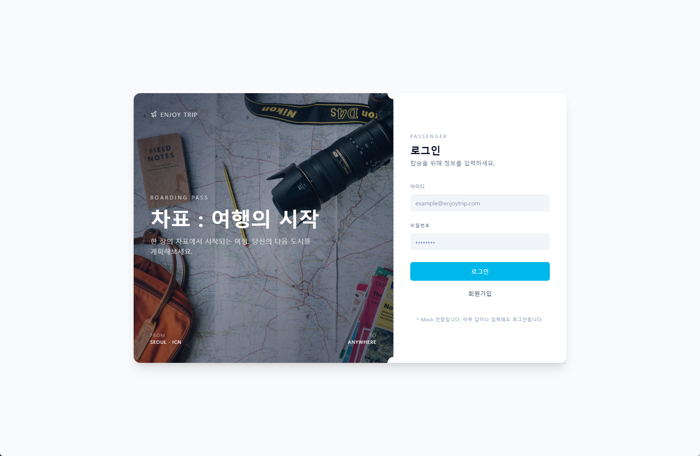
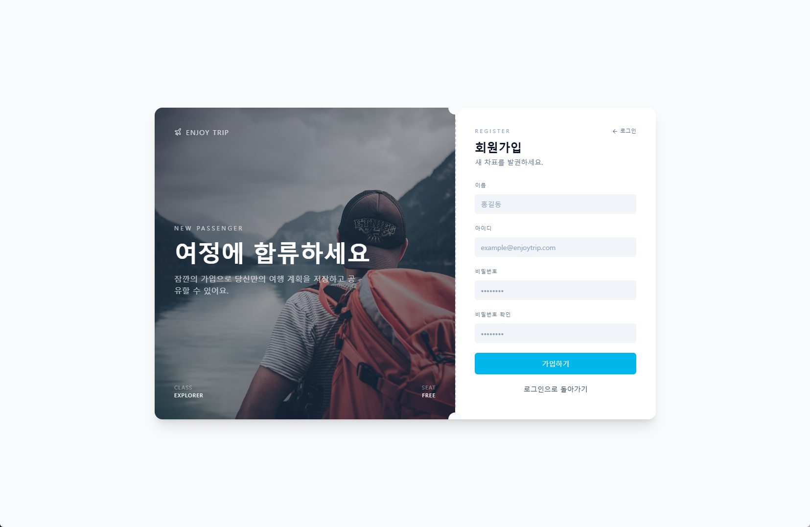
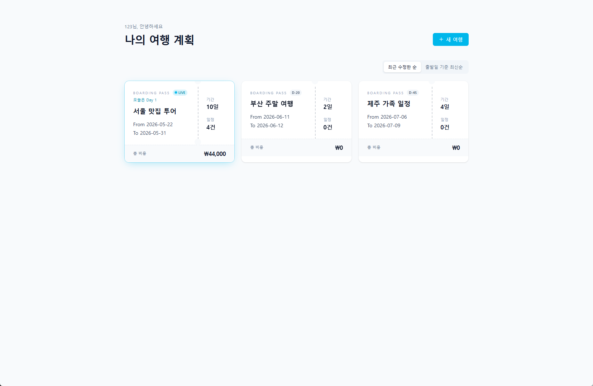
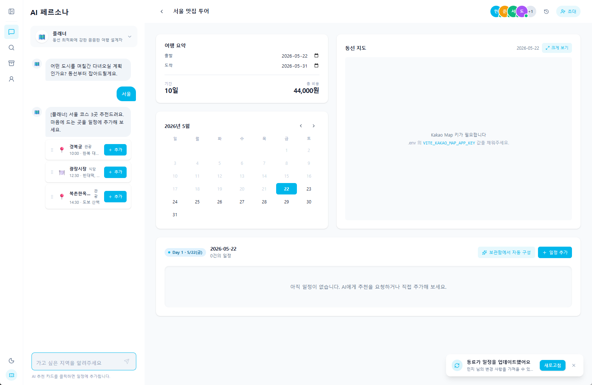
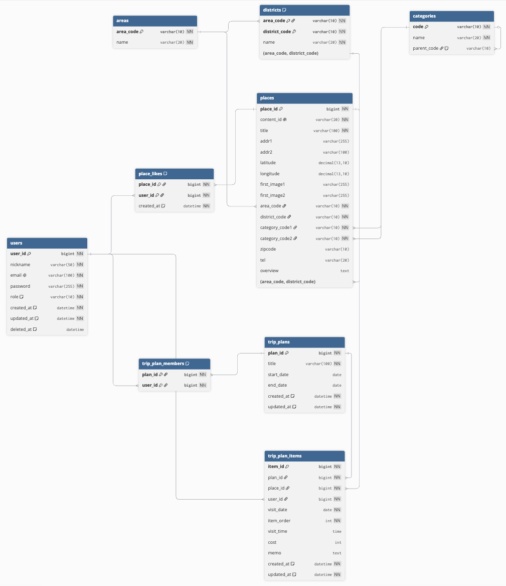

# ChaPyo: 여행의 시작

> AI 페르소나 기반 여행 계획 서비스

---

## 목차

1. [문제 정의](#문제-정의)
2. [페르소나](#페르소나)
3. [기술 스택](#기술-스택)
4. [요구사항 분석](#요구사항-분석)
5. [화면 설계](#화면-설계)
6. [ERD](#erd)
7. [API 명세](#api-명세)

---

## 문제 정의

| 항목 | 내용 |
|------|------|
| **대상 (Target)** | 여행 계획 수립에 스트레스를 느끼는 2030 자유여행객 |
| **상황 (Context)** | 블로그·SNS에 흩어진 정보를 검색하고 메모장에 수동으로 옮기며 일정을 짜는 비효율적인 상황 |
| **불편함 (Pain Points)** | 정보 과잉으로 인한 결정 장애 → 동선 고려 없이 일정 확정 → 현지에서 이동 비효율·체력 낭비 |
| **경쟁 서비스** | **트리플**: 정적인 일정 추천, AI 없음 / **마이리얼트립**: 상품 예약 중심 / **ChatGPT 등**: AI 추천은 되지만 일정 저장 불가 |
| **차별점 (USP)** | 취향별 **AI 페르소나** (플래너·미식가·가성비·럭셔리)와 대화하며 추천받은 장소를 **카드 클릭 한 번으로 일정에 즉시 반영** |

---

## 페르소나

> "계획을 짜는 것은 어렵지만, 모두가 만족하는 계획을 짜고싶어"

| 항목 | 내용 |
|------|------|
| **이름** | 번개싸피 |
| **나이** | 28세 (99년생) |
| **직업/상황** | SSAFY 교육생 / 2학기 준비 기간 동안 여자친구와의 여행 계획 중 |
| **여행 스타일** | 상대방에게 맞춰주는 에겐 스타일, 상세하게 계획을 짜는 것을 좋아함 |

### Pain Points

- 블로그 5개 열어서 맛집 리스트 뽑고, 지도 앱에서 거리 하나하나 재는 게 너무 귀찮음
- ChatGPT에 물어봐도 추천 결과를 일정표에 직접 붙여넣어야 해서 이중 작업 발생
- 맞춤형 플랜을 짜고 싶은데, 상대방이 여행에서 어떤 것을 좋아할지 아직 잘 모르겠음
- 여자친구와 실시간으로 같이 여행 일정을 짜고 싶음

### 사용 동기

AI가 각자의 취향(미식가 페르소나)을 반영해 추천 방문지를 짜주고, 추천 결과를 바로 일정표에 올릴 수 있어서 검색·정리·편집을 한 화면에서 끝내고 싶다. 실시간으로 수정 내용이 반영되기 때문에 같이 여행 일정을 짤 수 있다.

### 사용 시나리오

| 단계 | 행동 |
|------|------|
| 1 | 로그인 후 채팅에서 **'미식가' AI 페르소나** 선택 |
| 2 | "부산 1박 2일, 해산물 위주로 동선 짜줘" 입력 |
| 3 | AI가 추천 카드 제시 → 마음에 드는 장소 **클릭하여 우측 일정표에 추가** |
| 4 | 일정표에서 순서 드래그로 조정, 동선 확인 |

---

## 기술 스택

| 구분 | 기술 스택 | 상세 내용 |
|------|-----------|-----------|
| **Frontend** | Vue.js 3 | Composition API 기반의 반응형 UI 구현 |
| **Backend** | Spring Boot 3 | RESTful API 서버 구축 (Java Track) |
| **Persistence** | MyBatis | XML 기반 SQL 매핑을 통한 정교한 쿼리 관리 |
| **Database** | MySQL 8.0 | 관계형 데이터베이스 설계 및 관리 |
| **AI 연동** | OpenAI API | 페르소나 기반 대화 및 일정 추천 로직 구현 |
| **API 연동** | Public Data Portal | 한국관광공사 국문 관광 정보 서비스 API 활용 |

---

## 요구사항 분석

| 도메인 | 기능 | 설명 | 우선순위 |
|--------|------|------|----------|
| 회원 | 회원가입 | 이름, 아이디(이메일), 비밀번호, 비밀번호 확인 입력으로 계정 생성 | Must |
| 회원 | 로그인 | 아이디(이메일)·비밀번호 인증 | Must |
| 회원 | 로그아웃 | 로그인 상태 종료 | Must |
| 회원 | 회원 조회 | 내 프로필 정보 확인 | Must |
| 회원 | 회원 수정 | 이름, 비밀번호 등 정보 변경 | Should |
| 회원 | 비밀번호 찾기 | 이메일로 재설정 링크 발송 | Should |
| 회원 | 회원 탈퇴 | 계정 삭제 및 관련 데이터 처리 | Should |
| 여행 계획 | 여행 계획 생성 | 새 여행 계획 생성 | Must |
| 여행 계획 | 여행 계획 목록 조회 | 생성한 여행 계획을 카드 형태로 목록 표시 (여행명, D-day, 기간, 날짜, 일정 건수, 총 비용) | Must |
| 여행 계획 | 여행 계획 상세 조회 | 여행 요약, 캘린더, 동선 지도(카카오맵), Day별 일정 카드 표시 | Must |
| 여행 계획 | 여행 계획 정렬 | 최근 수정한 순 / 출발일 기준 최신순으로 정렬 | Should |
| 여행 계획 | 여행 계획 수정 | 여행명, 날짜 등 기본 정보 수정 | Should |
| 여행 계획 | 여행 계획 삭제 | 여행 계획 및 포함된 일정 삭제 | Should |
| 일정 | 일정 카드 조회 | Day별 일정 카드 표시 (장소명, 시간, 설명, 비용, 타입, 장소 간 거리·이동시간) | Must |
| 일정 | 일정 카드 순서 변경 | 일정 카드 드래그앤드롭으로 순서 조정, 동선 지도 자동 업데이트 | Must |
| 일정 | 일정 카드 삭제 | 일정에서 특정 장소 제거 | Must |
| 일정 | 동선 지도 표시 | 카카오맵 기반으로 일정 장소들의 동선 시각화 | Must |
| 장소 추가 | DB 검색으로 장소 추가 | 시도→구군→타입 필터 또는 텍스트 검색으로 장소 탐색 후 일정에 추가 | Must |
| 장소 추가 | AI 추천으로 장소 추가 | 페르소나 선택 후 AI와 대화, 추천 카드를 일정에 추가 | Must |
| 장소 추가 | 보관함에서 장소 추가 | 보관함에 저장된 장소를 일정에 추가 | Should |
| 보관함 | 장소 보관함 저장 | 마음에 드는 장소를 보관함에 저장 | Should |
| 보관함 | 장소 보관함 조회 | 보관함에 저장된 장소 목록 조회 | Should |
| 보관함 | 장소 보관함 삭제 | 보관함에서 장소 제거 | Should |
| 동료 | 동료 초대 | 여행 계획에 동료 초대 (이메일 또는 링크) | Could |
| 동료 | 동료 일정 업데이트 알림 | 동료가 일정을 변경했을 때 실시간 알림 | Could |
| AI 페르소나 | 페르소나 선택 | 플래너/미식가/가성비/럭셔리 중 페르소나 선택 | Must |
| AI 페르소나 | AI 대화 | 선택한 페르소나 기반으로 자연어 대화 및 장소 추천 | Must |
| AI 페르소나 | 대화 히스토리 조회 | 이전 대화 목록 사이드바에서 조회 및 이어서 대화 | Could |

---

## 화면 설계

### 로그인 페이지

### 회원가입 페이지

### 여행 리스트 페이지

### 여행 수정 페이지

---

## ERD

[ERD](https://dbdiagram.io/d/chapyo-6a1167b4dfb20dafcdd6034e)

### users

| 타입 | 컬럼명 | 제약 |
| --- | --- | --- |
| BIGINT | user_id | PK, NOT NULL, AUTO_INCREMENT |
| VARCHAR(50) | nickname | NOT NULL |
| VARCHAR(100) | email | NOT NULL, UNIQUE |
| VARCHAR(255) | password | NOT NULL |
| ENUM | role | NOT NULL, DEFAULT 'USER' ('USER', 'ADMIN') |
| DATETIME | created_at | NOT NULL, DEFAULT CURRENT_TIMESTAMP |
| DATETIME | updated_at | NOT NULL, DEFAULT CURRENT_TIMESTAMP ON UPDATE CURRENT_TIMESTAMP |
| DATETIME | deleted_at | DEFAULT NULL |

### trip_plans

| 타입 | 컬럼명 | 제약 |
| --- | --- | --- |
| BIGINT | plan_id | PK, NOT NULL, AUTO_INCREMENT |
| VARCHAR(100) | title | NOT NULL |
| DATE | start_date |  |
| DATE | end_date |  |
| DATETIME | created_at | NOT NULL, DEFAULT CURRENT_TIMESTAMP |
| DATETIME | updated_at | NOT NULL, DEFAULT CURRENT_TIMESTAMP ON UPDATE CURRENT_TIMESTAMP |

### trip_plan_members

| 타입 | 컬럼명 | 제약 |
| --- | --- | --- |
| BIGINT | plan_id | PK, NOT NULL, FK → trip_plans.plan_id |
| BIGINT | user_id | PK, NOT NULL, FK → users.user_id |

### trip_plan_items

| 타입 | 컬럼명 | 제약 |
| --- | --- | --- |
| BIGINT | item_id | PK, NOT NULL, AUTO_INCREMENT |
| BIGINT | plan_id | NOT NULL, FK → trip_plans.plan_id |
| BIGINT | place_id | NOT NULL, FK → places.place_id |
| BIGINT | user_id | NOT NULL, FK → users.user_id |
| DATE | visit_date | NOT NULL |
| INT | item_order | NOT NULL |
| TIME | visit_time |  |
| INT | cost |  |
| TEXT | memo |  |
| DATETIME | created_at | NOT NULL, DEFAULT CURRENT_TIMESTAMP |
| DATETIME | updated_at | NOT NULL, DEFAULT CURRENT_TIMESTAMP ON UPDATE CURRENT_TIMESTAMP |

### areas

| 타입 | 컬럼명 | 제약 |
| --- | --- | --- |
| VARCHAR(10) | area_code | PK, NOT NULL |
| VARCHAR(20) | name | NOT NULL |

### districts

| 타입 | 컬럼명 | 제약 |
| --- | --- | --- |
| VARCHAR(10) | area_code | PK, NOT NULL, FK → areas.area_code |
| VARCHAR(10) | district_code | PK, NOT NULL |
| VARCHAR(20) | name | NOT NULL |

### categories

| 타입 | 컬럼명 | 제약 |
| --- | --- | --- |
| VARCHAR(10) | code | PK, NOT NULL |
| VARCHAR(20) | name | NOT NULL |
| VARCHAR(10) | parent_code | FK → categories.code, DEFAULT NULL |

### places

| 타입 | 컬럼명 | 제약 |
| --- | --- | --- |
| BIGINT | place_id | PK, NOT NULL, AUTO_INCREMENT |
| VARCHAR(20) | content_id | NOT NULL, UNIQUE |
| VARCHAR(100) | title | NOT NULL |
| VARCHAR(255) | addr1 |  |
| VARCHAR(100) | addr2 |  |
| DECIMAL(13, 10) | latitude |  |
| DECIMAL(13, 10) | longitude |  |
| VARCHAR(255) | first_image1 |  |
| VARCHAR(255) | first_image2 |  |
| VARCHAR(10) | area_code | NOT NULL, FK → areas.area_code, FK → districts.area_code |
| VARCHAR(10) | district_code | NOT NULL, FK → districts.district_code (area_code와 복합) |
| VARCHAR(10) | category_code1 | NOT NULL, FK → categories.code |
| VARCHAR(10) | category_code2 | NOT NULL, FK → categories.code |
| VARCHAR(10) | zipcode |  |
| VARCHAR(20) | tel |  |
| TEXT | overview |  |

### place_likes

| 타입 | 컬럼명 | 제약 |
| --- | --- | --- |
| BIGINT | place_id | PK, NOT NULL, FK → places.place_id |
| BIGINT | user_id | PK, NOT NULL, FK → users.user_id |
| DATETIME | created_at | NOT NULL, DEFAULT CURRENT_TIMESTAMP |

---

## API 명세

| 기능 | 도메인 | Method | URL |
|------|--------|--------|-----|
| 회원가입 | 회원 | POST | `/api/v1/users` |
| 로그인 | 회원 | POST | `/api/v1/auth/login` |
| 로그아웃 | 회원 | POST | `/api/v1/auth/logout` |
| 회원 조회 | 회원 | GET | `/api/v1/users/me` |
| 회원 수정 | 회원 | PATCH | `/api/v1/users/me` |
| 비밀번호 찾기 | 회원 | POST | `/api/v1/auth/password/reset` |
| 회원 탈퇴 | 회원 | DELETE | `/api/v1/users/me` |
| 여행 계획 생성 | 여행 계획 | POST | `/api/v1/trips` |
| 여행 계획 목록 조회 | 여행 계획 | GET | `/api/v1/trips` |
| 여행 계획 상세 조회 | 여행 계획 | GET | `/api/v1/trips/{tripId}` |
| 여행 계획 정렬 | 여행 계획 | GET | `/api/v1/trips?sort={type}` |
| 여행 계획 수정 | 여행 계획 | PATCH | `/api/v1/trips/{tripId}` |
| 여행 계획 삭제 | 여행 계획 | DELETE | `/api/v1/trips/{tripId}` |
| 일정 카드 조회 | 일정 | GET | `/api/v1/trips/{tripId}/schedules` |
| 일정 카드 순서 변경 | 일정 | PATCH | `/api/v1/trips/{tripId}/schedules/order` |
| 일정 카드 삭제 | 일정 | DELETE | `/api/v1/trips/{tripId}/schedules/{scheduleId}` |
| 동선 지도 표시 | 일정 | GET | `/api/v1/trips/{tripId}/map` |
| DB 검색으로 장소 추가 | 장소 추가 | GET | `/api/v1/places?sido={}&gugun={}&type={}&q={}` |
| AI 추천으로 장소 추가 | 장소 추가 | POST | `/api/v1/trips/{tripId}/schedules/ai` |
| 보관함에서 장소 추가 | 장소 추가 | POST | `/api/v1/trips/{tripId}/schedules/bookmarks` |
| 장소 보관함 저장 | 보관함 | POST | `/api/v1/bookmarks` |
| 장소 보관함 조회 | 보관함 | GET | `/api/v1/bookmarks` |
| 장소 보관함 삭제 | 보관함 | DELETE | `/api/v1/bookmarks/{placeId}` |
| 동료 초대 | 동료 | POST | `/api/v1/trips/{tripId}/members` |
| 동료 일정 업데이트 알림 | 동료 | GET | `/api/v1/trips/{tripId}/notifications` |
| 페르소나 선택 | AI 페르소나 | POST | `/api/v1/ai/persona` |
| AI 대화 | AI 페르소나 | POST | `/api/v1/ai/chat` |
| 대화 히스토리 조회 | AI 페르소나 | GET | `/api/v1/ai/chat/history` |